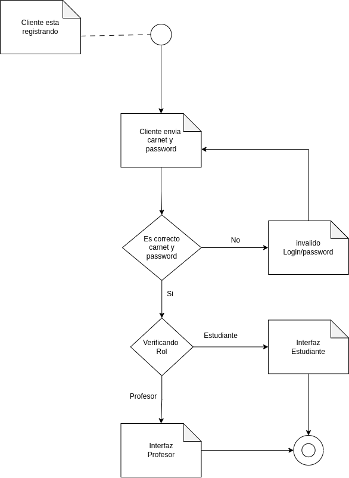
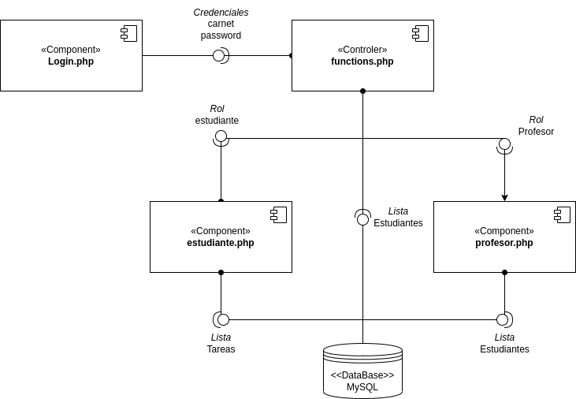
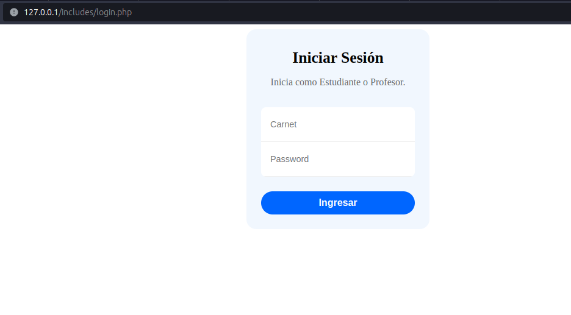
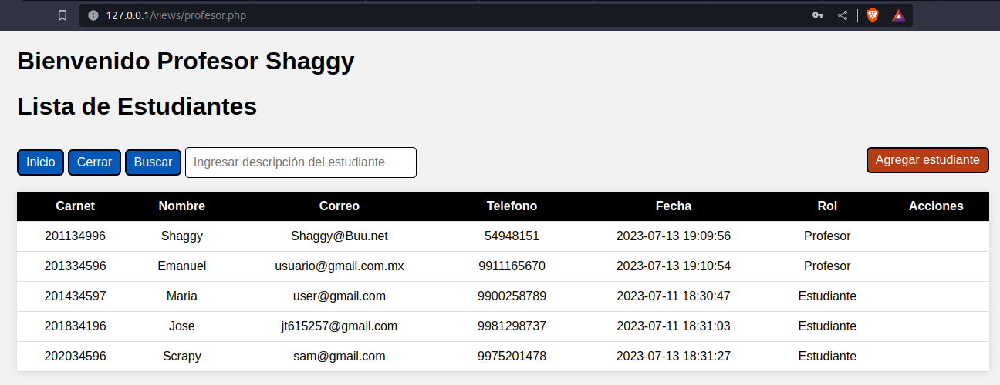
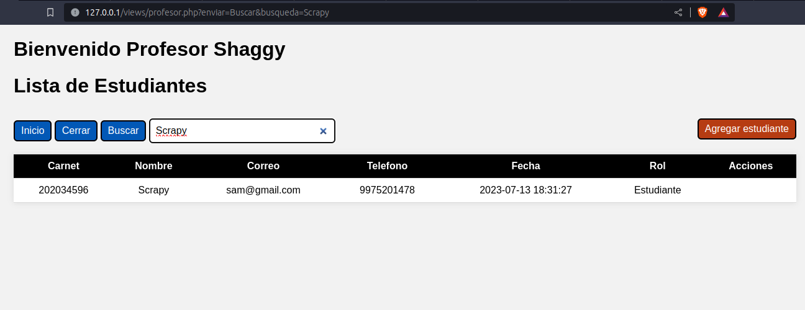
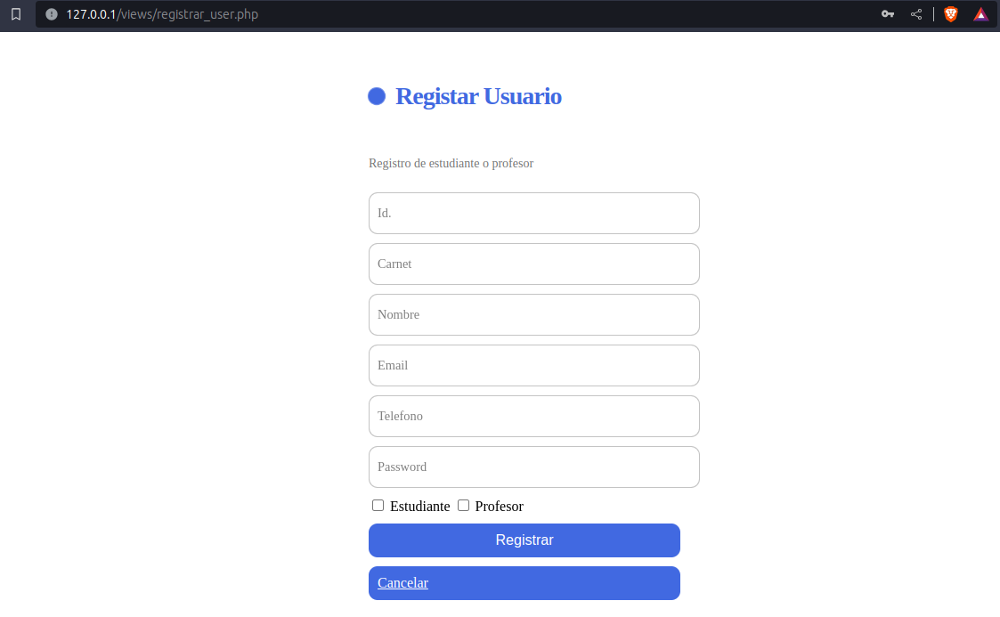
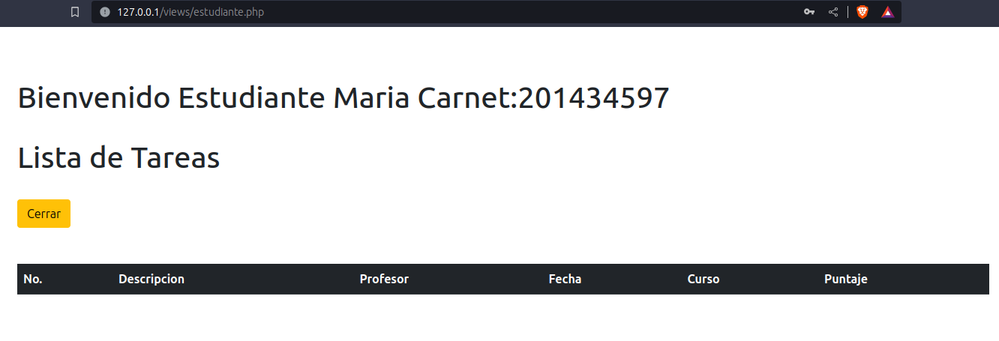

# Practica1_TS1_2023

- [Marco Teórico](#marco-teórico)
- [Manual Técnico](#manual-técnico)
- [Manual Usuario](#manual-de-usuario)

<h3>Objetivo General:</h3>

- Implementar un sistema para el registro de notas para cada estudiante utilizando una plataforma web.

<h3>Objetivos especificos:</h3>

- [x] Creacion del modelo y la base de datos en MySQL.
- [x] Implementación de las funciones básicas de una aplicación web (CRUD).
- [x] Diseño e implementación de los formularios necesarios para realizar operaciones sobre la información almacenada en la base de datos.
- [x] Conexión con PHP, HTML5, javascript y CSS3.

## Marco Teórico

La informática es una rama de los campos que se ocupan de procesamiento digital de información.

<b> El marco teórico consiste en los siguientes: </b>
 
<h3>Modelo Entidad Relacional.</h3>
Los diagramas entidad-relación o el modelo entidad relación son un tipo de diagrama de flujo que posee entidades, atributos y relaciones. Estos elementos son indispensables en el ERD y su función es representarlos gráficamente y diseñar un modelo conceptual que permita señalar cómo los diferentes elementos se relacionan entre sí.
 
<h3> Lenguaje SQL. </h3>
El lenguaje de consulta estructurada (SQL) es un lenguaje de consulta popular que se usa con frecuencia en todos los tipos de aplicaciones. Los analistas y desarrolladores de datos aprenden y usan SQL porque se integra bien con los diferentes lenguajes de programación. Por ejemplo, pueden incrustar consultas SQL con el lenguaje de programación Java para crear aplicaciones de procesamiento de datos de alto rendimiento con los principales sistemas de bases de datos SQL, como Oracle o MS SQL Server. Además, SQL es muy fácil de aprender, ya que en sus instrucciones se utilizan palabras clave comunes en inglés.
 
<h3>Sistema gestor de bases de datos. </h3>
A los Sistemas Lógicos de Gestion de Datos o Sistemas de gestión de información es un campo que se encarga de administrar todos aquellos procesos necesarios
de Datos o Sistemas Lógicos de Bases de Datos son conjuntos matemático-lógicos que
permiten representar información como objetos y relaciones entre dichos objetos.
Los sistemas lógicos de bases de datos se caracterizan por ser flexibles e independientes a cualquier tipo de almacenamiento
En este sentido, se pueden definir tres tipos principales de bases de datos relacionales: Relacional, NoSQL e Híbrid
Los sistemas lógicos de bases de datos se caracterizan por tener una gran cantidad de tablas relacionadas entre sí.
 
<h3> Programación orientada a objetos. </h3>
Podemos entender la programación Orientada a objetos (POO) como una forma especial de programar, más cercana a como expresaríamos las cosas en la vida real que otros tipos de programación, que permite diseñar mejor las aplicaciones, llegando a mayores cotas de complejidad, sin que el código se vuelva inmanejable.
Al programar orientado a objetos tenemos que aprender a pensar cómo resolver los problemas de una manera distinta a como se realizaba anteriormente, en la programación estructurada. Ahora tendremos que escribir nuestros programas en términos de clases, objetos, propiedades, métodos y otras cosas que veremos rápidamente para aclarar conceptos y dar una pequeña base que permita soltarnos un poco con los conceptos de este tipo de programación.
 
<h3> Servidor Web (APACHE). </h3>
La funcionalidad principal de este servicio web es servir a los usuarios todos los ficheros necesarios para visualizar la web. Las solicitudes de los usuarios se hacen normalmente mediante un navegador (Chrome, Firefox, Safari, etc.).
Apache tiene una estructura basada en módulos, que permite activar y desactivar funcionalidades adicionales, por ejemplo, módulos de seguridad como mod_security, módulos de caché como Varnish, o de personalización de cabeceras como mod_headers. También permite ajustar los parámetros de PHP de tu hosting de forma personalizada mediante el fichero .htaccess.
 
<h3> Aplicaciones web. </h3>
Una aplicación web es un software que se ejecuta en el navegador web. Las empresas tienen que intercambiar información y proporcionar servicios de forma remota. Utilizan aplicaciones web para comunicarse con los clientes cuando lo necesiten y de una forma segura.
Las aplicaciones web tienen muchos beneficios, y casi todas las empresas grandes las utiliza como parte de sus ofertas para usuarios. A continuación se muestran alguno de los beneficios comunes asociados a las aplicaciones web.
 
<h3> Diseño de interfaces gráficas. </h3>
En el entorno de interacción persona-ordenador, la interfaz (o interfaz de usuario) es lo que permite que la interacción entre persona y ordenador ocurra. Es decir, la interfaz permite:

1. Que la persona pueda controlar efectivamente las acciones de la máquina.
1. Que la persona reciba respuestas de la máquina que le permitan saber si la interacción es correcta y cómo seguir actuando.
 
<h3> Manejo de archivos. </h3>
A continuación, veamos qué estructura debería tener tu sitio de prueba. Las cosas más comunes que tendrás en cualquier proyecto de sitio web que crees son un archivo de índice HTML y directorios para contener imágenes, archivos de estilo y archivos de script. Crea estos ahora:

1. **index.html:** Este archivo generalmente tendrá el contenido de tu página de inicio, es decir, el texto y las imágenes que las personas ven cuando visitan tu sitio por primera vez. Usando tu editor de texto, crea un nuevo archivo llamado index.html y guárdalo dentro de tu directorio pruebasitio.
1. **Directorio images:** Este directorio contendrá todas las imágenes que utilices en tu sitio. Crea un directorio llamado images, dentro de tu directorio pruebasitio.
1. **Directorio styles:** Este directorio contendrá el código CSS que se utiliza para aplicar estilo al contenido (por ejemplo, configurar el texto y los colores de fondo). Crea un directorio llamado styles, dentro de tu directorio pruebasitio.
1. **Directorio scripts:** Este directorio contendrá todo el código JavaScript utilizado para agregar funcionalidad interactiva a tu sitio (por ejemplo, botones que cargan datos cuando se hace clic en ellos). Crea un directorio llamado scripts, dentro de tu directorio pruebasitio.
 
<h3> Bases de Datos relacionales. </h3>
Una **base de datos relacional** es, en esencia, un conjunto de tablas (o relaciones) formadas por filas (registros) y columnas (campos); así, cada registro (cada fila) tiene una ID única, denominada clave y las columnas de la tabla contienen los atributos de los datos. Cada registro tiene normalmente un valor para cada atributo, lo que simplifica la creación de relaciones entre los puntos de datos.
 
<h3> Estructura de tablas. </h3>
Una tabla en base de datos es un tipo de modelado de datos donde se guarda una información recogida por un sistema. Es decir, son objetos o estructuras que contienen los datos organizados en filas y columnas. Cada fila representa un registro único, y cada columna un campo dentro del registro. 

+ **Campos:** El campo es el nombre de la columna. Es un dato único y se le otorga un único tipo de datos.
+ **Registros:** Los registros son cada una de las tablas. Aquí se almacenan o cargan los datos que guardamos. Algunos de estos datos pueden ser nulos.
 
<h2>Link de referencia</h2>

+ [Apache](https://axarnet.es/blog/que-es-apache)

+ [Aplicación web](https://aws.amazon.com/es/what-is/web-application/)

+ [Diseño de Interfaces Gráficas](https://www.youtube.com/watch?v=94bZ_)

+ [Manejo de archivos](https://developer.mozilla.org/es/docs/Learn/Getting_started_with_the_web/Dealing_with_files)

+ [Base de datos relacionales](https://ayudaleyprotecciondatos.es/bases-de-datos/relacional/)

+ [Esctructura de tablas](https://blog.comparasoftware.com/que-es-tabla-en-base-de-datos/)

## Manual Técnico

### Diagrama de Actividades
Diagramas de actividades, son considerados diagramas de comportamiento porque describen lo que debe suceder en el sistema que se está modelando.

### Diagrama de Componente
Los diagramas de componentes UML representan las relaciones entre los componentes individuales del sistema mediante una vista de diseño estática. Pueden ilustrar aspectos de modelado lógico y físico.

### Diagrama de Paquete
Los diagramas de paquetes son diagramas estructurales que se emplean para mostrar la organización y disposición de diversos elementos de un modelo en forma de paquetes.

 
 ## Manual de Usuario

 ### Inicio Sesión:
 En este caso La aplicación esta en producción y esta inicializado en mi computador
 , y se integro en apache donde esta alojado en el **localhost(127.0.0.1)** donde me va a redireccionar a *login.php*
 , esta parte es necesario ingresar las credenciales puede se de **estudiante** o **profesor** que son *carnet* y *contraseña(password)*
 

### Rol de Profesor
En esta interfaz se visualiza las opciones de:
+ Inicio = regresa a sus valores de Profesor.
+ Cerrar = elimina las credenciales y regresa a login.
+ Registrar Alumno = permite registrar alumnos nuevos, solo puede hacerlo si tiene permisos.
+ Listado = todos los usuarios.

#### Búsqueda de usuario
Esta opción ingresa el nombre del estudiante y filtrará todos los user.

#### Registro de User
Registrar un nuevo usuario.

### Rol de Estudiante
En esta interfaz se visualiza las opciones de:
+ Inicio = regresa a sus valores de Estudiante.
+ Cerrar = elimina las credenciales y regresa a Login.
+ listado = todos los datos de sus tareas.

